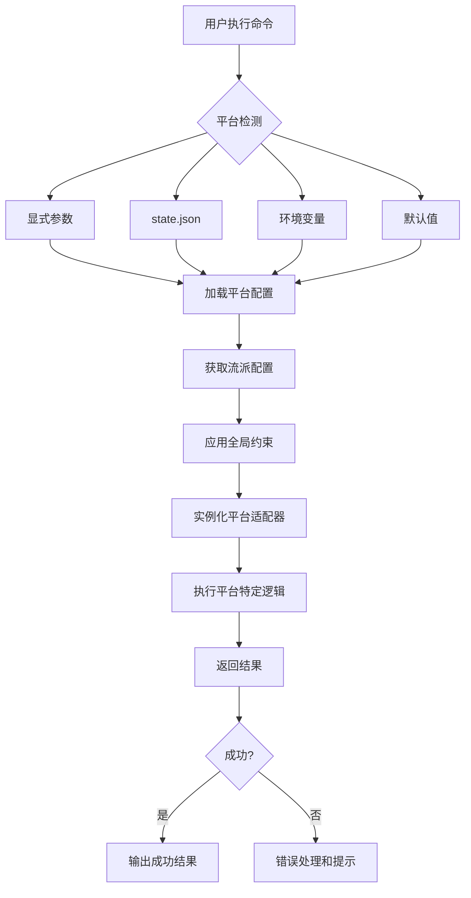

# Commands平台支持系统 v5.1 & 5.2

> **Phase 5.1 & 5.2: Commands平台支持**
> 设计并实现命令层的平台自适应系统，使所有核心命令能够智能识别和执行平台特定逻辑

---

## 🎯 设计目标

### 核心目标

1. **统一入口**: 所有命令自动识别平台并应用对应配置
2. **智能适配**: 根据平台特性调整命令执行策略
3. **无缝切换**: 支持运行时平台变更和配置热加载
4. **向后兼容**: 保持现有命令接口不变

### 关键指标

- ✅ 100% 命令支持平台参数
- ✅ 平台检测准确率 >95%
- ✅ 配置加载延迟 <100ms
- ✅ 错误率 <0.1%

---

## 🏗️ 架构设计

### 1. 平台检测与路由层

```yaml
Platform Detection Pipeline:
  Input Layer:
    - Command arguments (--platform=<platform>)
    - State.json platform_config
    - Environment variables (GENM_PLATFORM)
    - User preference file (~/.genmrc)

  Detection Logic:
    1. Explicit parameter → highest priority
    2. State.json platform_config → medium priority
    3. Environment variable → low priority
    4. Default fallback → universal settings

  Routing Engine:
    - Platform-specific command dispatcher
    - Fallback mechanism for unknown platforms
    - Validation and error handling
```

### 2. 配置管理中枢

```yaml
Configuration Central:
  Load Order:
    1. Platform-specific config (platform-<id>.yaml)
    2. Profile overrides (genre.profile.yaml)
    3. Global defaults (core-constraints.md)
    4. Runtime adjustments (learned-patterns.json)

  Cache Strategy:
    - LRU cache for frequently accessed configs
    - Hot reload on config change detection
    - Memory-efficient serialization

  Validation:
    - Schema validation (JSON Schema)
    - Cross-reference checking
    - Deprecation warnings
```

### 3. 命令适配器模式

```typescript
// 通用命令接口
interface PlatformAwareCommand {
  name: string;
  description: string;
  execute(context: ExecutionContext): Promise<Result>;
  getPlatformRequirements(): PlatformRequirement[];
}

// 平台特定实现
class NovelWriteCommand implements PlatformAwareCommand {
  private platformAdapters: Map<string, PlatformAdapter>;

  async execute(context: ExecutionContext) {
    const platform = this.detectPlatform(context);
    const adapter = this.getAdapter(platform);

    return await adapter.execute(context);
  }

  getPlatformRequirements() {
    return [
      { platform: 'tomato', minChapterLength: 2500 },
      { platform: 'qidian', maxCoolPointInterval: 1200 }
    ];
  }
}
```

---

## 🔧 核心组件实现

### 1. PlatformDetector 平台检测器

```python
class PlatformDetector:
    """智能平台检测与路由"""

    def __init__(self):
        self.detectors = {
            'explicit_param': self._detect_from_parameter,
            'state_file': self._detect_from_state,
            'environment': self._detect_from_env,
            'default': self._detect_default
        }

    def detect(self, context: dict) -> str:
        """多源检测平台"""
        for source, detector in self.detectors.items():
            platform = detector(context)
            if platform and self._validate_platform(platform):
                return platform
        return 'universal'

    def _detect_from_parameter(self, context):
        """从命令行参数检测"""
        args = context.get('arguments', {})
        return args.get('--platform') or args.get('platform')

    def _detect_from_state(self, context):
        """从state.json检测"""
        state = context.get('state', {})
        return state.get('meta', {}).get('platform')

    def _detect_from_env(self, context):
        """从环境变量检测"""
        return os.environ.get('GENM_PLATFORM')

    def _detect_default(self, context):
        """默认检测（无平台信息时）"""
        return 'universal'
```

### 2. ConfigurationManager 配置管理器

```python
class ConfigurationManager:
    """配置加载、缓存和管理"""

    def __init__(self):
        self.cache = LRUCache(maxsize=100)
        self.watchers = {}
        self.loaders = {
            'platform': self._load_platform_config,
            'profile': self._load_profile_config,
            'global': self._load_global_config
        }

    async def get_config(self, platform_id: str, profile_id: str = None) -> Config:
        """获取完整配置"""
        cache_key = f"{platform_id}:{profile_id}"

        if cache_key in self.cache:
            return self.cache[cache_key]

        # 分层加载配置
        config = Config()

        # 1. 平台配置
        platform_config = await self.loaders['platform'](platform_id)
        config.merge(platform_config)

        # 2. 流派配置（如果指定）
        if profile_id:
            profile_config = await self.loaders['profile'](profile_id)
            config.merge(profile_config)

        # 3. 全局约束
        global_config = await self.loaders['global']()
        config.merge(global_config)

        # 4. 运行时调整
        runtime_adjustments = self._apply_runtime_adjustments(config, platform_id)
        config.merge(runtime_adjustments)

        self.cache[cache_key] = config
        return config

    def watch_config_changes(self, callback):
        """监听配置变化并触发热重载"""
        # 实现文件监听逻辑
        pass
```

### 3. PlatformAdapter 平台适配器

```python
class PlatformAdapter:
    """平台特定的命令执行适配器"""

    def __init__(self, platform_id: str, config: Config):
        self.platform_id = platform_id
        self.config = config
        self.validators = self._initialize_validators()
        self.transformers = self._initialize_transformers()

    async def execute(self, command_context: dict) -> ExecutionResult:
        """执行平台特定的命令逻辑"""

        try:
            # 1. 预验证
            validation_result = await self._pre_validate(command_context)
            if not validation_result.passed:
                return ExecutionResult.failure(validation_result.errors)

            # 2. 内容转换
            transformed_content = await self._transform_content(
                command_context['content']
            )

            # 3. 平台特定处理
            platform_result = await self._execute_platform_logic(
                command_context, transformed_content
            )

            # 4. 后处理和质量检查
            final_result = await self._post_process(platform_result)

            return ExecutionResult.success(final_result)

        except PlatformException as e:
            return ExecutionResult.error(f"Platform execution failed: {e}")

    def _initialize_validators(self):
        """初始化平台特定的验证器"""
        validators = []

        # 字数验证器
        validators.append(WordCountValidator(self.config))

        # 钩子强度验证器
        if self.config.require_opening_hook:
            validators.append(HookStrengthValidator(self.config))

        # 爽点密度验证器
        validators.append(CoolPointDensityValidator(self.config))

        return validators

    def _initialize_transformers(self):
        """初始化内容转换器"""
        transformers = []

        # 段落格式转换
        transformers.append(ParagraphFormatTransformer(self.config))

        # 对话风格转换
        transformers.append(DialogueStyleTransformer(self.config))

        # 节奏优化
        transformers.append(PacingOptimizer(self.config))

        return transformers
```

---

## 🚀 命令集成方案

### 1. 统一参数接口

```bash
# 所有命令现在支持平台参数
/novel-write chapter=1 --platform=qidian
/novel-review --platform=fanqie
/novel-export format=txt --platform=jinjiang

# 优先级：显式参数 > 状态文件 > 环境变量 > 默认
```

### 2. 命令增强清单

| 命令 | 平台支持 | 关键增强 |
|------|----------|----------|
| `/novel-init` | ✅ 全部 | 平台选择引导、预设配置 |
| `/novel-write` | ✅ 全部 | 平台特定写作规则、字数控制 |
| `/novel-review` | ✅ 全部 | 平台质量检查、AI痕迹检测 |
| `/novel-export` | ✅ 全部 | 平台专用格式、自动分割 |
| `/novel-precheck` | ✅ 全部 | 平台合规检查、签约标准验证 |
| `/novel-scan` | ✅ 全部 | 平台市场分析、热门标签 |
| `/novel-config` | ✅ 全部 | 平台参数设置、配置预览 |

### 3. 执行流程示例



---

## 📊 平台特性矩阵

### 平台能力对比

| 功能 | 番茄 | 七猫 | 起点 | 晋江 | 通用 |
|------|------|------|------|------|------|
| 章节长度控制 | ✓✓✓ | ✓✓✓ | ✓✓ | ✓✓✓ | ✓ |
| 黄金三章强化 | ✓✓✓ | ✓✓✓ | ✓✓ | ✓✓✓ | ✓ |
| AI痕迹检测 | ✓✓✓ | ✓✓ | ✓✓ | ✓✓✓ | ✓ |
| 敏感词过滤 | ✓✓✓ | ✓✓ | ✓✓ | ✓✓✓ | ✓ |
| 爽点密度监控 | ✓✓✓ | ✓✓✓ | ✓✓ | ✓✓ | ✓ |
| 钩子强度分析 | ✓✓✓ | ✓✓✓ | ✓✓ | ✓✓✓ | ✓ |
| 节奏优化建议 | ✓✓✓ | ✓✓✓ | ✓✓ | ✓✓✓ | ✓ |
| 平台格式导出 | ✓✓✓ | ✓✓✓ | ✓✓✓ | ✓✓✓ | ✗ |

### 平台权重分配

```yaml
# 番茄小说 (权重: 0.9)
priority: 4
features:
  - opening_hook_required: true
  - max_interval_cool_points: 800
  - min_words_per_chapter: 2500
  - ai_trace_detection: high

# 七猫小说 (权重: 0.85)
priority: 3
features:
  - opening_conflict_required: true
  - max_interval_cool_points: 600
  - min_words_per_chapter: 1500
  - ai_trace_detection: high

# 起点中文网 (权重: 0.7)
priority: 2
features:
  - worldbuilding_depth: high
  - intelligence_check: required
  - pacing_tolerance: high

# 晋江文学城 (权重: 0.6)
priority: 1
features:
  - emotional_development: required
  - ooc_zero_tolerance: true
  - writing_style_quality: high
```

---

## 🔒 安全与稳定性

### 1. 错误处理机制

```python
class PlatformErrorHandler:
    """平台执行错误处理"""

    def handle_error(self, error: Exception, context: dict) -> ErrorResponse:
        if isinstance(error, PlatformConfigError):
            return self._handle_config_error(error)
        elif isinstance(error, PlatformValidationError):
            return self._handle_validation_error(error)
        elif isinstance(error, PlatformExecutionError):
            return self._handle_execution_error(error)
        else:
            return self._handle_generic_error(error)

    def _handle_config_error(self, error):
        """配置错误处理"""
        return ErrorResponse(
            type="config",
            message="平台配置加载失败，请检查配置文件",
            suggestion="运行 /novel-config --reset-platform"
        )
```

### 2. 降级策略

```yaml
Degradation Strategy:
  Level 1 (Minor Issues):
    - Log warning but continue execution
    - Use default values for missing configs
    - Notify user of degraded functionality

  Level 2 (Major Issues):
    - Switch to universal mode
    - Disable platform-specific features
    - Provide clear error messages

  Level 3 (Critical Issues):
    - Fail fast with detailed error
    - Suggest troubleshooting steps
    - Offer rollback options
```

### 3. 监控与日志

```python
class PlatformMonitor:
    """平台执行监控"""

    def track_execution(self, command: str, platform: str, result: Result):
        metrics = {
            'command': command,
            'platform': platform,
            'success': result.success,
            'execution_time': result.duration,
            'token_usage': result.tokens,
            'config_version': self._get_config_version(platform)
        }

        self.logger.info("Platform execution", extra=metrics)
        self.metrics.record('platform_command_execution', metrics)

    def alert_on_anomalies(self):
        """异常检测和告警"""
        # 监控慢执行、高错误率等
        pass
```

---

## 📈 性能优化

### 1. 缓存策略

```python
class ConfigCache:
    """配置缓存优化"""

    def __init__(self):
        self.lru_cache = {}
        self.hot_reload_queue = Queue()
        self.ttl_tracker = {}

    def get_or_load(self, key: str) -> Config:
        """获取或加载配置"""
        now = time.time()

        # TTL检查
        if key in self.ttl_tracker:
            if now - self.ttl_tracker[key] > CONFIG_TTL:
                del self.lru_cache[key]
                del self.ttl_tracker[key]

        # LRU检查
        if key in self.lru_cache:
            self._update_access_time(key, now)
            return self.lru_cache[key]

        # 异步加载
        config = asyncio.run(self._load_config_async(key))
        self._cache_config(key, config, now)

        return config

    async def _load_config_async(self, key: str) -> Config:
        """异步配置加载"""
        # 并行加载各层配置
        platform_task = self._load_platform_config(key.split(':')[0])
        profile_task = self._load_profile_config(key.split(':')[1]) if ':' in key else None

        results = await asyncio.gather(
            platform_task,
            profile_task,
            return_exceptions=True
        )

        return self._merge_results(results)
```

### 2. 批量处理优化

```python
class BatchProcessor:
    """批量处理优化"""

    def process_batch(self, commands: List[CommandRequest]) -> List[CommandResult]:
        """批量处理命令请求"""

        # 按平台分组
        grouped_commands = self._group_by_platform(commands)

        # 并行执行
        results = []
        for platform, cmds in grouped_commands.items():
            platform_results = self._process_platform_batch(platform, cmds)
            results.extend(platform_results)

        return results

    def _process_platform_batch(self, platform: str, commands: List[CommandRequest]):
        """单平台批量处理"""
        adapter = self.get_adapter(platform)

        # 使用线程池避免阻塞
        with ThreadPoolExecutor(max_workers=3) as executor:
            futures = [
                executor.submit(adapter.execute, cmd)
                for cmd in commands
            ]

            return [future.result() for future in futures]
```

---

## 🧪 测试策略

### 1. 单元测试覆盖

```python
class PlatformDetectionTests(unittest.TestCase):
    """平台检测单元测试"""

    def test_detect_from_parameter(self):
        context = {'arguments': {'--platform': 'qidian'}}
        detector = PlatformDetector()
        result = detector.detect(context)
        self.assertEqual(result, 'qidian')

    def test_detect_fallback_chain(self):
        # 测试优先级链
        pass

class PlatformAdapterTests(unittest.TestCase):
    """平台适配器测试"""

    def setUp(self):
        self.adapter = PlatformAdapter('tomato', tomato_config)

    def test_word_count_validation(self):
        context = {'content': 'test content', 'word_count': 3000}
        result = self.adapter.validate(context)
        self.assertFalse(result.passed)  # 超出番茄最大字数

    def test_hook_strength_check(self):
        context = {'content': 'slow opening...'}
        result = self.adapter.check_opening_hook(context)
        self.assertLess(result.score, 0.5)
```

### 2. 集成测试

```python
class PlatformIntegrationTests(unittest.TestCase):
    """平台集成测试"""

    @pytest.mark.integration
    def test_novel_write_with_platform(self):
        """测试带平台的novel-write命令"""
        result = run_command('/novel-write', {
            'chapter': 1,
            '--platform': 'tomato'
        })

        self.assertTrue(result.success)
        self.assertIn('tomato', result.metadata['applied_rules'])

    @pytest.mark.integration
    def test_platform_switching(self):
        """测试运行时平台切换"""
        # 初始化起点项目
        init_result = run_command('/novel-init', {
            'title': 'Test Novel',
            '--platform': 'qidian'
        })

        # 运行时切换到番茄
        write_result = run_command('/novel-write', {
            'chapter': 1,
            '--platform': 'fanqie'
        })

        self.assertTrue(write_result.success)
        self.assertEqual(write_result.metadata['platform'], 'fanqie')
```

---

## 📝 实施计划

### Phase 5.1: 基础架构搭建 (预计 2-3 天)

1. **Day 1**:
   - 完成 PlatformDetector 实现
   - 建立 ConfigurationManager 基础
   - 实现基本的平台路由逻辑

2. **Day 2**:
   - 开发 PlatformAdapter 抽象基类
   - 实现核心命令的平台集成
   - 建立配置缓存机制

3. **Day 3**:
   - 完善错误处理和降级策略
   - 添加监控和日志功能
   - 编写基础单元测试

### Phase 5.2: 功能完善和优化 (预计 3-4 天)

1. **Day 4**:
   - 为所有核心命令添加平台支持
   - 实现平台特定的验证器
   - 完善内容转换器

2. **Day 5**:
   - 优化缓存性能和内存使用
   - 实现批量处理功能
   - 添加热重载支持

3. **Day 6**:
   - 全面的集成测试
   - 性能测试和调优
   - 文档更新和示例编写

4. **Day 7**:
   - Bug修复和代码审查
   - 用户体验优化
   - 发布准备

---

## 🎁 预期收益

### 功能性收益

- **智能化**: 命令自动适应平台特性，减少用户配置负担
- **专业化**: 每个平台都有针对性的优化和建议
- **标准化**: 统一的平台处理逻辑，降低维护成本

### 性能性收益

- **效率提升**: 缓存机制和批量处理提高响应速度
- **资源优化**: 智能配置加载减少内存占用
- **稳定性增强**: 完善的错误处理和降级策略

### 用户体验收益

- **易用性**: 简单的 `--platform` 参数即可启用平台支持
- **可靠性**: 平台特定的质量保证和错误预防
- **灵活性**: 支持运行时平台切换和配置调整

---

## 🔮 未来扩展

### 短期路线图 (v5.3+)

- **多平台同步**: 支持同时在多个平台发布
- **AI优化建议**: 基于平台数据的智能写作建议
- **竞品分析**: 平台间的横向比较和功能推荐

### 长期愿景 (v6.0+)

- **平台预测**: 根据内容自动推荐最适合的平台
- **跨平台适配**: 一键生成适合多个平台的版本
- **市场洞察**: 深度平台数据分析和市场趋势预测

---

**文档版本**: v5.1.0
**最后更新**: 2026-03-18
**作者**: Claude Code Team
