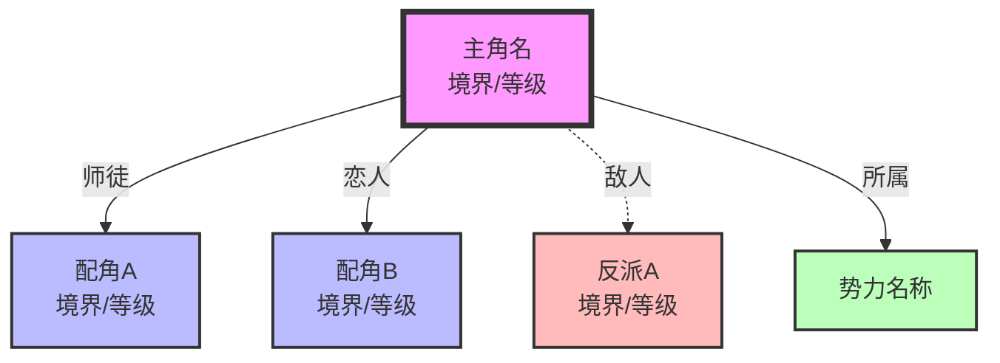
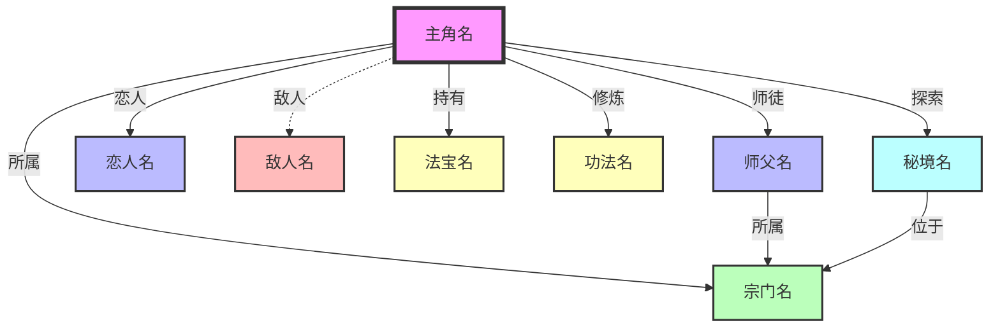
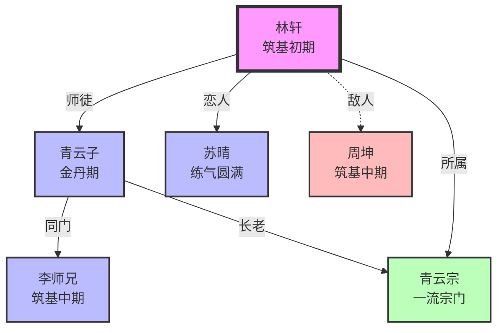

# 实体关系图模板

> 用于生成和存储角色关系图

## 模板信息

- **版本**: 2.0
- **用途**: 关系图生成模板
- **触发命令**: `/novel-character graph`

## 关系图配置

### 布局选项

| 布局代码 | 布局名称 | 适用场景 |
|----------|----------|----------|
| TD | 从上到下 | 层级分明的关系 |
| LR | 从左到右 | 时间线式关系 |
| network | 网络图 | 复杂关系网络 |

### 节点样式定义

```mermaid
classDef protagonist fill:#f9f,stroke:#333,stroke-width:4px
classDef supporting fill:#bbf,stroke:#333,stroke-width:2px
classDef antagonist fill:#fbb,stroke:#333,stroke-width:2px
classDef faction fill:#bfb,stroke:#333,stroke-width:2px
classDef item fill:#ffb,stroke:#333,stroke-width:2px
classDef location fill:#bfb,stroke:#333,stroke-width:2px
```

### 样式说明

| 类型 | 颜色 | 边框 | 适用 |
|------|------|------|------|
| protagonist | 粉色 | 4px 粗边框 | 主角 |
| supporting | 蓝色 | 2px 边框 | 配角 |
| antagonist | 红色 | 2px 边框 | 反派 |
| faction | 绿色 | 2px 边框 | 势力 |
| item | 黄色 | 2px 边框 | 重要物品 |
| location | 青色 | 2px 边框 | 地点 |

### 关系线样式

| 关系类型 | 线条 | 颜色 | 说明 |
|----------|------|------|------|
| 师徒 | `-->` | 蓝色 | 传承关系 |
| 恋人 | `-->` | 粉色 | 情感关系 |
| 敌人 | `-.->` | 红色虚线 | 敌对关系 |
| 盟友 | `-->` | 绿色 | 合作关系 |
| 亲属 | `==>` | 紫色粗线 | 血缘关系 |
| 同门 | `-->` | 青色 | 同门关系 |
| 主仆 | `-->` | 橙色 | 从属关系 |

---

## 关系图模板

### 基础模板



### 扩展模板（含物品/地点）



---

## 实体索引模板

### 角色实体索引

```xml
<!-- 角色实体索引 -->
<entities type="角色">
  <entity name="主角名" role="主角" status="活跃">
    <power_level>境界</power_level>
    <location>当前位置</location>
    <first_appearance>第N章</first_appearance>
  </entity>

  <entity name="配角名" role="配角" status="活跃">
    <power_level>境界</power_level>
    <location>当前位置</location>
  </entity>

  <entity name="反派名" role="反派" status="活跃">
    <power_level>境界</power_level>
    <location>当前位置</location>
  </entity>
</entities>
```

### 势力实体索引

```xml
<!-- 势力实体索引 -->
<entities type="势力">
  <entity name="宗门名" tier="层级" stance="立场">
    <leader>首领名</leader>
    <territory>领地</territory>
  </entity>
</entities>
```

### 物品实体索引

```xml
<!-- 物品实体索引 -->
<entities type="物品">
  <entity name="物品名" grade="品级" owner="持有者">
    <abilities>能力描述</abilities>
    <origin>来源</origin>
  </entity>
</entities>
```

### 功法实体索引

```xml
<!-- 功法实体索引 -->
<entities type="功法">
  <entity name="功法名" tier="层级" grade="品级">
    <requirements>修炼条件</requirements>
    <owner>归属</owner>
  </entity>
</entities>
```

---

## 关系索引模板

### 角色关系索引

```xml
<!-- 角色关系索引 -->
<relations>
  <!-- 师徒关系 -->
  <relation from="徒弟名" to="师父名" type="师徒" strength="强"/>

  <!-- 恋人关系 -->
  <relation from="角色A" to="角色B" type="恋人" strength="中"/>

  <!-- 敌人关系 -->
  <relation from="角色A" to="角色B" type="敌人" strength="中"/>

  <!-- 盟友关系 -->
  <relation from="角色A" to="角色B" type="盟友" strength="弱"/>

  <!-- 亲属关系 -->
  <relation from="角色A" to="角色B" type="亲属" strength="强"/>
</relations>
```

### 关系变化历史

```xml
<!-- 关系变化历史 -->
<relation_history>
  <change from="角色A" to="角色B" before="60" after="65" reason="原因" chapter="第N章"/>
</relation_history>
```

---

## 生成示例

### 示例项目关系图



---

## 使用说明

### 生成关系图

1. 执行命令：`/novel-character graph`
2. 可选参数：
   - `name=角色名` - 以指定角色为中心
   - `layout=TD/LR/network` - 选择布局

### 更新关系图

1. 章节写作完成后自动更新
2. 手动更新：`/novel-character relation`

### 查看关系详情

1. 查看所有关系：`/novel-character list`
2. 查看特定角色：`/novel-character view name=角色名`

---

## 文件存储位置

| 文件类型 | 存储路径 |
|----------|----------|
| 关系图 | 设定集/关系图.md |
| 角色卡 | 设定集/角色/*.md |
| 实体索引 | 设定集/实体/index.md |
| 关系索引 | 设定集/关系/index.md |